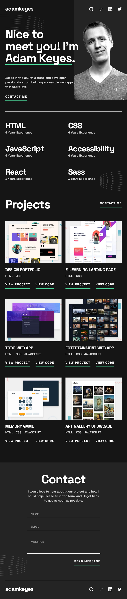
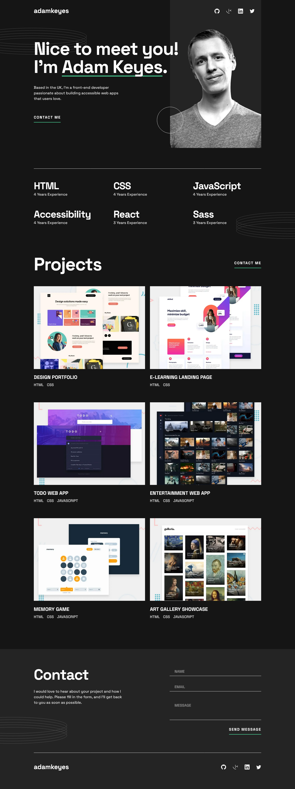

# Frontend Mentor - Single-page developer portfolio solution

This is a solution to the [Single-page developer portfolio challenge on Frontend Mentor](https://www.frontendmentor.io/challenges/singlepage-developer-portfolio-bBVj2ZPi-x). Frontend Mentor challenges help you improve your coding skills by building realistic projects.

## Table of contents

-   [Overview](#overview)
    -   [The challenge](#the-challenge)
    -   [Screenshot](#screenshot)
    -   [Links](#links)
-   [My process](#my-process)
    -   [Built with](#built-with)
    -   [What I learned](#what-i-learned)
    -   [Useful resources](#useful-resources)
-   [Author](#author)

## Overview

### The challenge

Users should be able to:

-   Receive an error message when the `form` is submitted if:
    -   Any field is empty
    -   The email address is not formatted correctly
-   View the optimal layout for the interface depending on their device's screen size
-   See hover and focus states for all interactive elements on the page
-   **Bonus**: Hook the form up so it sends and stores the user's enquiry (you can use a spreadsheet or Airtable to save the enquiries)
-   **Bonus**: Add your own details (image, skills, projects) to replace the ones in the design

### Screenshot

#### Mobile

#### Tablet

#### Desktop

### Links

-   [Solution URL](https://www.frontendmentor.io/solutions/developer-portfolio-using-react-and-typescript-5oTS93JpNv)
-   [Live Site URL](https://mgalvizo.github.io/single-page-developer-portfolio/)

## My process

### Built with

-   Semantic HTML5 markup
-   CSS custom properties
-   Flexbox
-   CSS Grid
-   Mobile-first workflow
-   [React](https://reactjs.org/) - JS library
-   [TypeScript](https://www.typescriptlang.org/)
-   [Styled Components](https://styled-components.com/)
-   [React Hook Form](https://react-hook-form.com/)
-   [React Hot Toast](https://react-hot-toast.com/)
-   [React Query](https://tanstack.com/query/v3/)

### What I learned

Writing React functional components, hooks and props with TypeScript.

Registering, watching and validating inputs with React Hook Form.

Writing a POST request to persist form data into a database.

Writing a query that performs a mutation adding a new entry to the database.

Showing a success or error notification when performing the query.

### Useful resources

-   [React Hook Form Docs](https://react-hook-form.com/get-started) - This helped me with the form data handling.
-   [React Query](https://tanstack.com/query/v3/docs/react/quick-start) - This helped with the query mutation implementation.
-   [React Hot Toast Docs](https://react-hot-toast.com/docs) - This helped me with the notification implementation.

## Author

-   Frontend Mentor - [@mgalvizo](https://www.frontendmentor.io/profile/mgalvizo)
